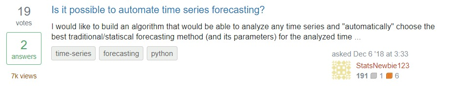
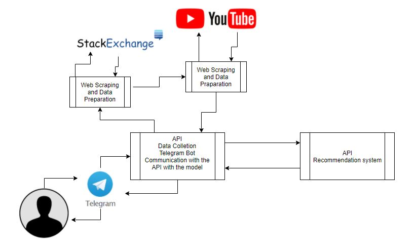
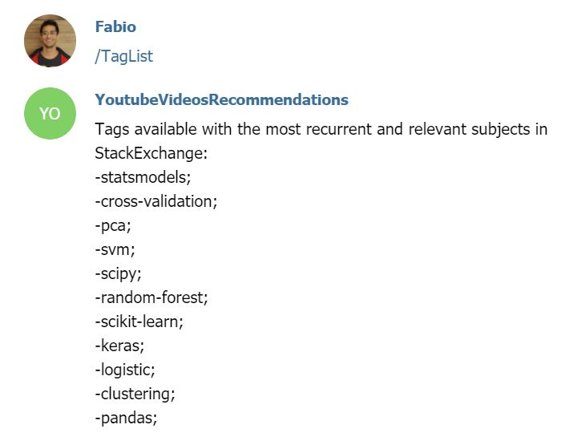
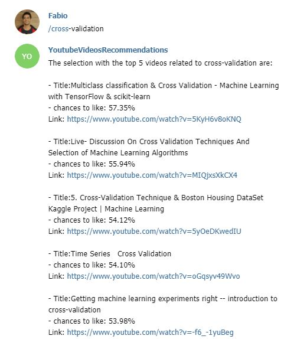
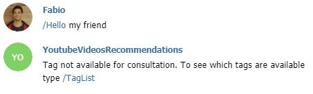

# Youtube-Video-Recommendations
Youtube recommendation of videos with subjects related to stackexchange questions with the tag "Python" and more frequently

# Youtube Problem
I am constantly looking for videos on youtube to learn or test new techniques of relevant topics in data science, but I end up spending a lot of time on this search. I want to use machine learning algorithms to recommend videos that I have a good chance of liking.

# Business Question

- What data science subjects are relevant?
- How do I select videos that are of my interest more quickly?

#### Solution for the Situation

With the premise of reducing search time, I will use machine learning algorithms which recommend the 5 videos of each relevant subject with greater chances of my liking. The recommendation will be returned through a bot that I can access and interact easily both by cell phone and computer.

>**This solution involves 3 main steps**
>- Survey of relevant subjects in Data Science.
>- Machine Leraning model construction for video recommendations.
>- Elaboration of the bot that performs interaction with the user.

- To survey relevant issues in datascience will be used the StatckExchange (link: <a href="https://stats.stackexchange.com/questions">StackExchange</a>)
StackExchange is a network of questions and answers (Q&A) on topics in various fields related to datascience, each question covers one or more of a subject through tags

- From videos that were related to be of my interest or not, will be developed machine learning models to recommend videos will be used predictive modeling techniques.

- Telegram will be used for the elaboration of the bot.

# Data Collection
Both youtube and StackExchange data will be collected via web scraping. To perform stackexchange web scraping was performed directly from the site's Front-end that follows the following example of pattern:

> StackExchange: <a href="https://github.com/FabioCaffarello/Youtube-Video-Recommendations/blob/master/telegramAPI/stack.py">Class used to perform web scraping</a>
>
> Youtube: <a href="https://github.com/FabioCaffarello/Youtube-Video-Recommendations/blob/master/telegramAPI/youtube.py">Class used to perform web scraping</a>

**These scrapes happen in sequence, the scraping result of StackExchange is processed to raise the subjects with greater recurrence and relevance of the subjects, which in turn determines the scraping parameters of youtube.**

# Data Labeling
- As the data do not have a target to pass to the model, which in turn will evaluate the possible videos of my interest. The targets have been manually categorized with the premise of adding in my list of videos to watch.

> To improve the modeling performance, a first categorization was performed and a second one was done through <a href="https://en.wikipedia.org/wiki/Active_learning">active learning</a>, which collected the sample of data in which the model had more difficulty to perform the predictive analyses

# Data Preparation

- As the data will be ingested in a relational database, most of the data treatment occurs in the scraping pipeline of the data from their respective sources, however not all the data will be used in the modeling, so some treatments will be performed in the database query.

- In the modeling pipeline performs some occasional treatments, for example, missing values.

# Feature Engineering

- Both StackExchange and Youtube data were used to deterninate the Features. 
> - Video Title
> - Duration
> - Total video views in relation to the total incidence of the subject in StackExchange
> - Total likes in Video in relation to total votes on the subject in StackExchange
> - Number of views per day from the time of posting

# Modeling
in the modeling an ensamble with the weighted average of **LGBMClassifier** and **RandomForestClassifier** models was performed to obtain a more robust solution. Both models had hyperparametrs tuned with the <a href="https://en.wikipedia.org/wiki/Bayesian_optimization">bayesian optimization</a> technique.

# Solution Deployment

To put in production this solution of recommendation of videos was carried through two APIs, being that the <a href="https://github.com/FabioCaffarello/Youtube-Video-Recommendations/tree/master/telegramAPI">first one</a> is linked to the bot of the Telegram and carries through the scraping of data as much of the stackExchange as of the Youtube, processes them and serializes to send the <a href="https://github.com/FabioCaffarello/Youtube-Video-Recommendations/tree/master/webapp">API that contains the model</a>, that will make the recommendation by subject of the 5 videos with greater chance of me like and returns the requesting API, that will return the answer to the bot of the Telegram, and therefore to the user.

- Heroku was used to host the APIs.
- To deploy the API linked to the Bot and scraping processes was used Docker.

### Architecture

# Results and Bot instructions

- For the user to interact with the bot there is the command "/TagList", which returns the subjects considered relevant.

- To access the list of recommended videos by subjects, just insert one of the tags of the list

- If the command assigned to the bot is different from the command to know the tags referring to the subjects or the subject in question the bot will return a message informing that the command is not available and suggests that you use the subject query cam, the "/TagList".

- **PS:** Every command assigned to the bot must contain the "/" character at the beginning